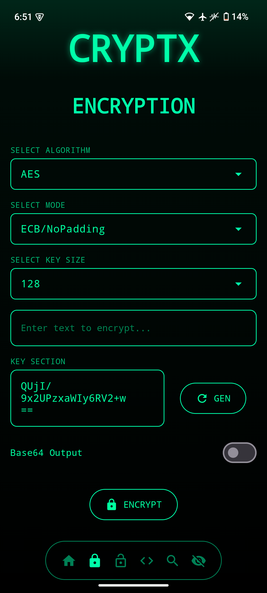
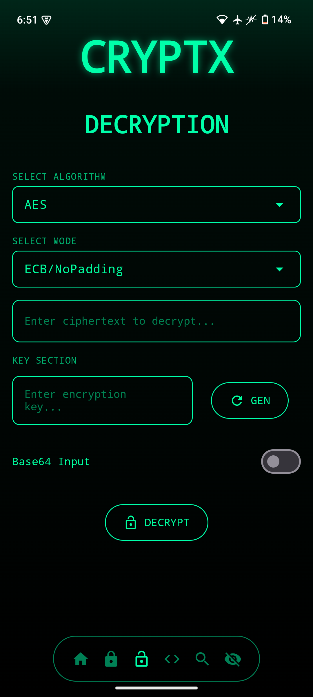
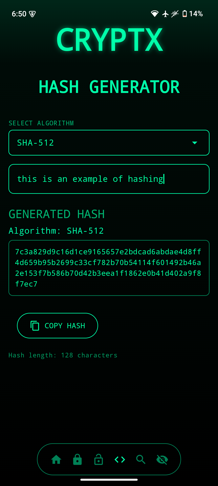
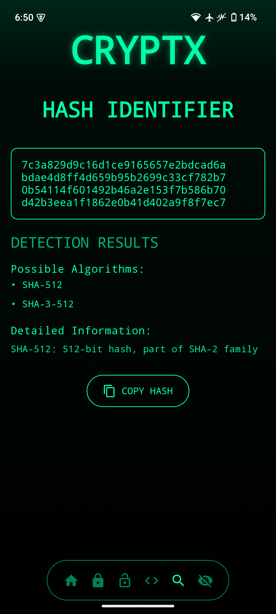
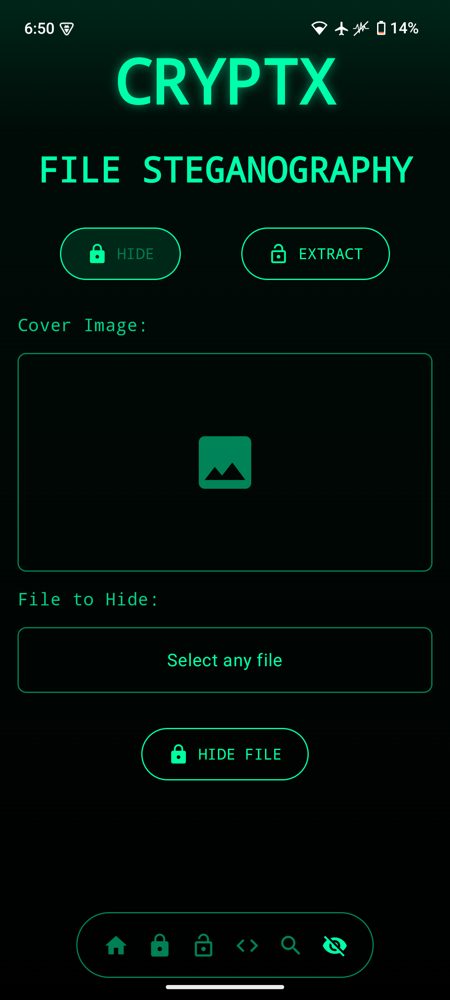

---

```markdown
# 🔐 CryptX — Simple Android Security Toolkit

CryptX is a personal project I built during my free time while studying Information Technology and learning about network security in college. It's not perfect, but it's something I made with passion and curiosity while experimenting with encryption and steganography. 😊

> ⚠️ This app is still in early development. There are bugs, and many features might be improved in the future. I'm just a student exploring things in my free time.

---

## 📱 Features

### 🔸 Encryption & Decryption
Supports popular symmetric encryption algorithms:
- **AES**
- **DES**
- **3DES**
- **Blowfish**
- **ChaCha20**

You can easily encrypt and decrypt any text using these algorithms with your own key.

### 🔸 Hash Generator
- Generate hashes like **MD5**, **SHA-1**, **SHA-256**, and more.

### 🔸 Hash Detector
- Try to detect which hashing algorithm was used based on the hash value.

### 🔸 File Steganography
- 🖼️ **Hide files inside images**
- 📂 **Extract hidden files from stego images**

Output files are saved in: /Download/cryptx/

## 📸 Screenshots

### 🔐 Home Screen


### 🔏 Encryption Screen


### 🔏 Decryption Screen


### 🔏 Decryption Generator


### 🔏 Hash Detector


### 🖼️ Steganography Feature

```

````

---

## 🧠 Why I Made This

I wanted to understand how cryptography and steganography actually work — not just in theory, but in real apps. So I built this to:
- Practice Android development (Jetpack Compose)
- Apply what I’ve learned in my networking and security classes
- Create something fun and functional for learning

---

## ⚙️ Technical Notes

- Built with **Jetpack Compose**
- Purely offline app (no internet permission)
- No user data is collected or stored
- Only files saved are the output from the **steganography feature**, which are stored locally

### 📂 Storage
- This app only saves files under `Download/cryptx/`
- No sensitive data is saved or tracked

---

## 🌍 Language Support

- Currently supports **only English**
- No internationalization (i18n) yet — might come in the future!

---

## 🛣️ Roadmap (Maybe... Someday 😊)

- Add support for more algorithms (e.g., RSA, ECC)
- Support for other languages
- Improve the UI/UX
- Fix current bugs
- Make steganography more stable
- Add support for more file types

---

## 🚀 Getting Started

To build and run CryptX on your Android device:

```bash
git clone https://github.com/PersonX-46/CryptX.git
````

Then:

1. Open the project in Android Studio
2. Run it on your emulator or device
3. Enjoy experimenting!

---

## 🙌 Contributions?

This is a personal learning project, but:

* If you spot bugs 🐞 — feel free to report
* If you have cool suggestions 💡 — let me know
* If you just wanna say hi 👋 — that's great too

I might be slow to reply since I’m doing this in my free time while studying, but I appreciate every bit of support and feedback.

---

<div align="center">
  <sub>Made with ❤️ by a student learning network security | "Still learning, still building"</sub>
</div>
```

---

